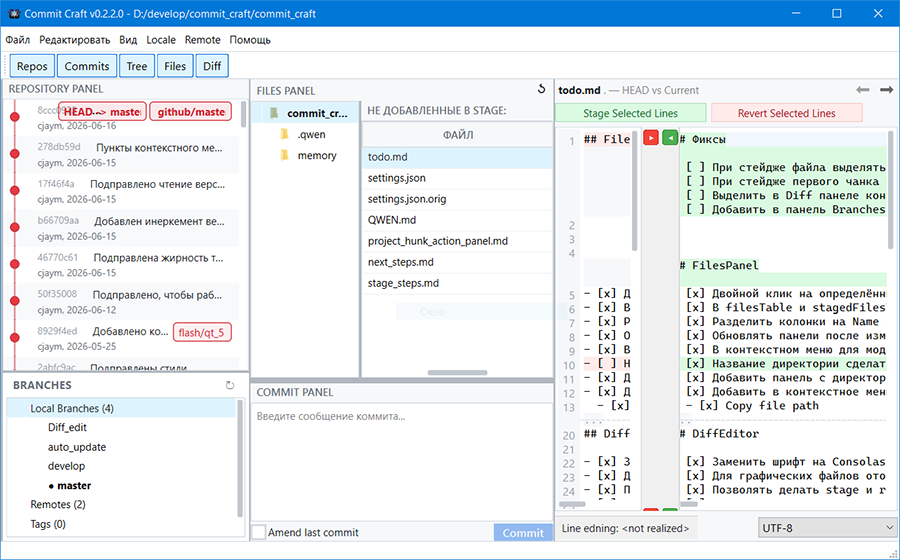

# Commit Craft

**Commit Craft** — десктопное C++/Qt-приложение для удобной работы с Git. Предоставляет интуитивный графический интерфейс для просмотра изменений, управления staged/unstaged файлами, навигации по ханкам diff и создания коммитов.

**ОСТОРОЖНО — vibecoding!!!** Вайбкожу для своих потребностей, фильтруя действия нейронки "по диагонали". Качество кода на уровне "работает".



## Возможности

### Управление файлами
- **Раздельное отображение** staged и unstaged файлов
- **Двухпанельный diff-вьюер** с подсветкой добавленных/удалённых строк
- **Навигация по ханкам** (переключение между изменениями)
- **Контекстные меню** с быстрыми действиями:
  - Stage/Unstage файлов
  - Открыть файл/папку
  - Копировать путь
  - Удалить файл
  - Отменить изменения (Discard)
  - Blame
- **Множественное выделение** файлов для массовых операций

### Работа с ветками
- **Панель Branches** с отображением:
  - Локальных веток
  - Удалённых веток (Remote)
  - Тегов (Tags)
  - Stash-записей
- **Операции с ветками**:
  - Переключение между ветками
  - Создание/удаление/переименование
  - Fetch и Prune для remote
  - Stash (Apply/Pop/Drop/Show)
  - Защита текущей ветки от удаления

### Коммиты и история
- **Создание коммитов** с сообщением
- **Amend** последнего коммита
- **История коммитов** с кастомным делегатом отображения
- **Автоматическое обновление** при изменениях файлов

### Горячие клавиши
| Клавиша | Действие |
|---------|----------|
| `Ctrl+Enter` | Создать коммит |
| `Ctrl+Колесо мыши` | Масштабирование diff |
| `F6` / `Shift+F6` | Следующее/предыдущее изменение |
| `F7` / `F8` | Push / Pull (в разработке) |

## Технологии

- **Язык**: C++17
- **Фреймворк**: Qt 5.14+ / Qt 6.x (Widgets, Gui)
- **Система сборки**: qmake (subdirs-проект)
- **UI Design**: Qt Designer (.ui файлы)
- **Тестирование**: Qt Test Framework (QTestLib)
- **Git-операции**: Асинхронные вызовы через QProcess


## Установка и запуск

### Требования
- **Qt 5.14+** или **Qt 6.x** (с модулями Widgets и Gui)
- **Qt Creator** (рекомендуется) или командная строка qmake
- **C++ компилятор** с поддержкой C++17 (MinGW/MSVC/GCC)
- **Git** (для работы функций приложения)

### Сборка в Qt Creator
1. Откройте `commit_craft_project.pro` в Qt Creator
2. Выберите набор инструментов (kit) — Desktop Qt 6.x MinGW 64-bit или аналогичный
3. Нажмите **Build** (`Ctrl+B`)

### Сборка из командной строки
```bash
qmake commit_craft_project.pro
make   # или mingw32-make / nmake в зависимости от компилятора
```

### Запуск приложения
После сборки запустите `commit_craft` из папки сборки. При первом запуске будет предложено выбрать Git-репозиторий.

### Запуск тестов
```bash
cd commit_craft_tests
run_tests.bat   # Windows
# или
./run_tests.sh  # Linux/macOS
```

## Архитектура

Проект организован как **subdirs-проект** с тремя подпроектами:

### 1. commit_craft_lib
Библиотека бизнес-логики, собирается первой:
- **Git** — асинхронная обёртка над Git CLI (QProcess)
- **GitParser** — парсер вывода `git diff` (hunks, HunkLine)
- **FileModel** — модель списка файлов (staged/unstaged)
- **CommitHistoryModel** — модель истории коммитов
- **CommitItemDelegate** — кастомное отображение коммитов

### 2. commit_craft_app
GUI-приложение, зависит от `commit_craft_lib`:
- **MainWindow** — главное окно с таблицами файлов, diff-вьюером, историей
- **DiffEditor** — двухпанельный diff-редактор с синхронизацией зума
- **CodeEditor** — редактор кода с номерами строк и подсветкой
- **BranchesWidget** — виджет управления ветками
- **SettingsDialog** — диалог настроек (путь к Git, шрифт)


## Roadmap

### ✅ Реализовано
- [x] Двухпанельный diff viewer с подсветкой изменений
- [x] Staged/Unstaged файлы с контекстными меню
- [x] Навигация по ханкам diff
- [x] Панель Branches (локальные/remote ветки, теги, stash)
- [x] Синхронизация масштаба между панелями
- [x] Создание коммитов с amend
- [x] Множественное выделение файлов
- [x] Auto-refresh при изменениях файлов
- [x] Сохранение состояния интерфейса

### 🔜 В разработке
- [ ] Push/Pull операции
- [ ] Partial staging (stage отдельных строк)
- [ ] Просмотр изображений для графических файлов
- [ ] Полноценное главное меню (File, Edit, View, Help)
- [ ] Реализация всех горячих клавиш
- [ ] Фильтр файлов по директории
- [ ] Добавление тегов через UI
- [ ] Создание Merge через UI

### 🎯 Планы на будущее
- [ ] Graph View (визуализация графа коммитов)
- [ ] Blame Viewer
- [ ] Bisect UI
- [ ] Conflict Solver
- [ ] Submodules management
- [ ] Save/Apply Patch
- [ ] Reflog View
- [ ] Pull Requests интеграция (GitHub/GitLab)
- [ ] Группы и Favorites для репозиториев

## Лицензия

Проект `Commit Craft` распространяется под лицензией **MIT**

## Участие в разработке

Честно признаюсь ещё в самом начале, что данный проект -- нейрослоп. Вы можете:
- Сообщать об ошибках
- Предлагать новые функции
- Присылать Pull Request

но не факт, что я это прочту.


Выпускаю по принципу, что если мне эта программа оказывается полезной (и я ею пользуюсь), то может она окажется полезной кому-нибудь ещё. Можете форкать. А что? А вдруг!